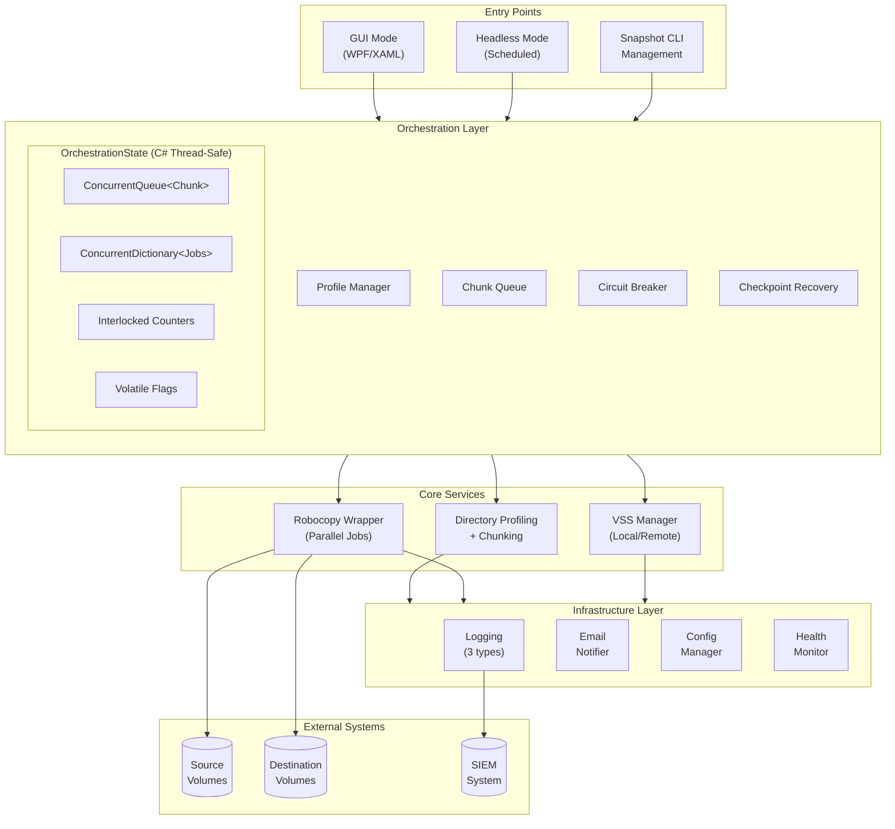
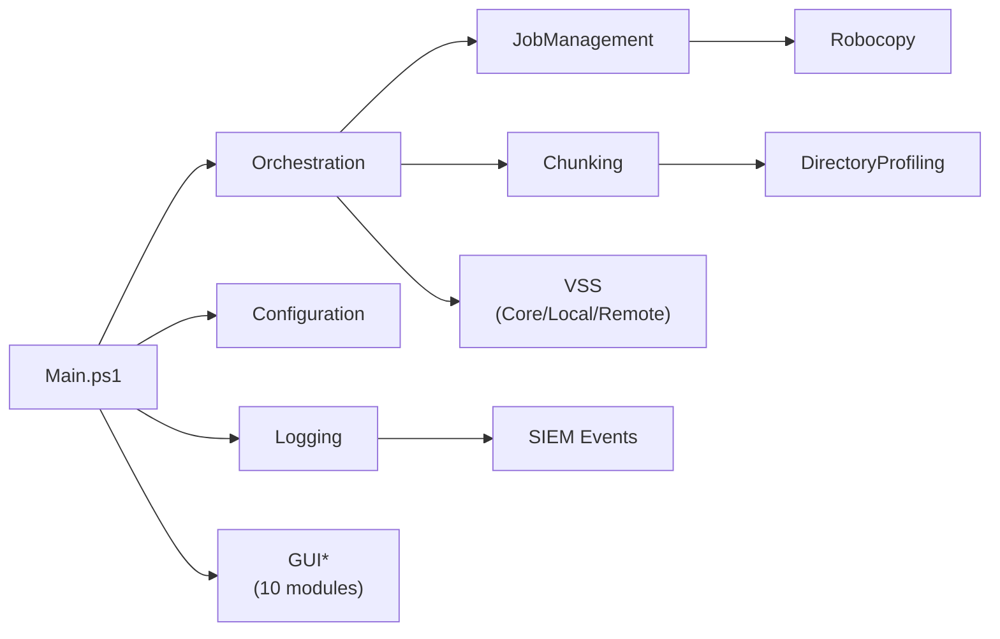

# Robocurse

**Parallel Robocopy Orchestration for Windows**

Robocurse manages what robocopy alone cannot: large-scale file replication across multiple sources without falling over. It intelligently chunks directories, runs parallel jobs, handles VSS snapshots for locked files, and recovers from failures—all without requiring expensive enterprise backup software.

> **Status**: Production-tested in enterprise environments. The core functionality is stable.

## The Problem

Robocopy is the backbone of Windows file replication. But at scale, it breaks down:

- **Single-threaded orchestration**: One massive directory tree overwhelms a single robocopy process
- **No parallel job management**: Running multiple robocopy instances manually is tedious and error-prone
- **Locked file failures**: Production servers have open files that robocopy can't copy
- **No recovery**: Crash mid-job and you're starting over
- **DFS Replication**: If you've tried DFS-R for this, you know why you're here

Robocurse solves these problems with a single deployable PowerShell script.

## Key Features

| Feature | What It Does |
|---------|--------------|
| **Intelligent Chunking** | Splits large directories into optimal parallel workloads |
| **Parallel Execution** | Runs 1-128 concurrent robocopy jobs with load balancing |
| **VSS Integration** | Backs up locked files via Volume Shadow Copy (local and remote) |
| **Crash Recovery** | Checkpoints progress; resumes from last completed chunk |
| **GUI + Headless** | Interactive WPF interface or CLI for scheduled tasks |
| **Email Notifications** | Completion reports with statistics |
| **Bandwidth Throttling** | Aggregate limit across all concurrent jobs |

## Quick Start

### 1. Deploy

Copy two files to your server:
```
dist/Robocurse.ps1          # The application (~550KB)
Robocurse.config.json       # Your configuration
```

### 2. Configure

Edit `Robocurse.config.json`:

```json
{
  "Version": "1.0",
  "GlobalSettings": {
    "MaxConcurrentJobs": 4,
    "LogPath": ".\\Logs"
  },
  "SyncProfiles": [
    {
      "Name": "DailyBackup",
      "Source": "\\\\FILESERVER\\Share",
      "Destination": "D:\\Backups\\FileServer",
      "UseVss": true,
      "SourceSnapshot": {
        "PersistentEnabled": false,
        "RetentionCount": 3
      },
      "DestinationSnapshot": {
        "PersistentEnabled": true,
        "RetentionCount": 7
      },
      "RobocopyOptions": {
        "Switches": ["/COPYALL"],
        "ExcludeDirs": ["$RECYCLE.BIN", "System Volume Information"]
      }
    }
  ]
}
```

### 3. Run

**GUI mode:**
```powershell
.\Robocurse.ps1
```

**Headless (for scheduled tasks):**
```powershell
.\Robocurse.ps1 -Headless -Profile "DailyBackup"
```

**Dry run (preview without copying):**
```powershell
.\Robocurse.ps1 -Headless -Profile "DailyBackup" -DryRun
```

## Requirements

- Windows Server 2016+ or Windows 10+
- PowerShell 5.1+
- Administrator rights (for VSS)
- Robocopy (included with Windows)

No external dependencies. No modules to install. One file.

---

## Installation

### Step 1: Enable Script Execution

PowerShell's default execution policy blocks scripts. Choose one of these approaches:

**Option A: User-level policy (recommended)**

Sets policy for your user account only, doesn't affect system-wide settings:

```powershell
Set-ExecutionPolicy RemoteSigned -Scope CurrentUser
```

**Option B: Per-session bypass**

Run Robocurse without changing any policies:

```powershell
powershell.exe -ExecutionPolicy Bypass -File .\Robocurse.ps1
```

For scheduled tasks, use Option B in the task action to avoid policy dependencies.

### Step 2: Deploy Files

Copy to your server:
```
Robocurse.ps1           # From dist/ folder (~550KB)
Robocurse.config.json   # Your configuration (customize from template)
```

### Step 3: Configure SMTP Credentials (Optional)

If using email notifications, store SMTP credentials in Windows Credential Manager:

```powershell
# Interactive prompt for password
cmdkey /add:Robocurse-SMTP /user:smtp-user@example.com /pass

# Or specify password directly (less secure - visible in history)
cmdkey /add:Robocurse-SMTP /user:smtp-user@example.com /pass:YourPassword
```

Then reference in your config:
```json
"EmailSettings": {
  "SmtpServer": "smtp.example.com",
  "SmtpPort": 587,
  "UseTls": true,
  "CredentialName": "Robocurse-SMTP",
  "From": "robocurse@example.com",
  "To": ["admin@example.com"]
}
```

To verify stored credentials:
```powershell
cmdkey /list:Robocurse-SMTP
```

To remove credentials:
```powershell
cmdkey /delete:Robocurse-SMTP
```

---

## Configuration Reference

### Chunk Settings

Control how directories are split for parallel processing:

| Setting | Range | Default | Description |
|---------|-------|---------|-------------|
| `ChunkMaxSizeGB` | 0.001 - 1024 | 10 | Maximum GB per chunk |
| `ChunkMinSizeGB` | 0.001 - 1024 | 0.1 | Minimum GB to create a chunk |
| `ChunkMaxFiles` | 1 - 10M | 50,000 | Maximum files per chunk |
| `ChunkMaxDepth` | 0 - 20 | 5 | Maximum directory recursion |

### Robocopy Options

Per-profile robocopy customization:

| Option | Type | Default | Description |
|--------|------|---------|-------------|
| `Switches` | string[] | `/COPY:DAT /DCOPY:T` | Additional robocopy flags |
| `ExcludeFiles` | string[] | `[]` | File patterns to skip (e.g., `*.tmp`) |
| `ExcludeDirs` | string[] | `[]` | Directory names to skip |
| `NoMirror` | bool | `false` | Use `/E` instead of `/MIR` |
| `SkipJunctions` | bool | `true` | Skip junction points |
| `RetryCount` | int | `3` | Retries per failed file |
| `RetryWait` | int | `10` | Seconds between retries |

**Note**: Robocurse manages `/MT:`, `/LOG:`, and progress flags automatically.

### Bandwidth Throttling

Limit aggregate bandwidth across all concurrent jobs:

```json
"GlobalSettings": {
  "MaxConcurrentJobs": 4,
  "BandwidthLimitMbps": 100
}
```

Bandwidth is dynamically divided among active jobs. Set to `0` for unlimited.

### Mismatch Handling

Control how robocopy exit code 4 (mismatches) is treated:

| Value | Behavior |
|-------|----------|
| `Warning` | (Default) Log warning, continue |
| `Error` | Treat as failure, trigger retry |
| `Success` | Ignore entirely |

Set globally or per-profile via `MismatchSeverity`.

### VSS Configuration

Robocurse offers two types of VSS snapshots:

| Type | Purpose | Lifetime |
|------|---------|----------|
| **Temporary (UseVss)** | Copy locked/open files during sync | Deleted immediately after job |
| **Persistent Snapshots** | Point-in-time recovery | Retained per your retention policy |

#### Per-Profile Snapshot Settings

Each profile can independently configure snapshots for both source and destination volumes:

```json
{
  "SyncProfiles": [
    {
      "Name": "DailyBackup",
      "Source": "\\\\FILESERVER\\Share",
      "Destination": "D:\\Backups",
      "UseVss": true,
      "SourceSnapshot": {
        "PersistentEnabled": true,
        "RetentionCount": 5
      },
      "DestinationSnapshot": {
        "PersistentEnabled": true,
        "RetentionCount": 7
      }
    }
  ]
}
```

| Setting | Description |
|---------|-------------|
| `UseVss` | Create temporary snapshot on source to copy locked files (deleted after sync) |
| `SourceSnapshot.PersistentEnabled` | Create persistent snapshot on source volume before backup |
| `SourceSnapshot.RetentionCount` | Number of snapshots to retain on source volume (1-100) |
| `DestinationSnapshot.PersistentEnabled` | Create persistent snapshot on destination volume before backup |
| `DestinationSnapshot.RetentionCount` | Number of snapshots to retain on destination volume (1-100) |

#### Intelligent MAX Retention

When multiple profiles share the same volume (source or destination), Robocurse uses the **maximum retention count** from all profiles targeting that volume during cleanup.

**Example:** Profile A backs up from `D:\Data1` with retention 3, Profile B backs up from `D:\Data2` with retention 7. Both target volume `D:`. When either profile runs, it creates a snapshot and cleans up old ones keeping **7** (the max).

This prevents snapshot accumulation while respecting each profile's declared retention requirements.

#### Pre-flight Check

```powershell
$check = Test-VssPrivileges
if (-not $check.Success) {
    Write-Warning "VSS not available: $($check.ErrorMessage)"
}
```

#### Local VSS

```powershell
$result = Invoke-WithVssJunction -SourcePath "C:\Data" -ScriptBlock {
    param($SourcePath)
    robocopy $SourcePath "D:\Backup" /MIR /R:0 /W:0
}
```

#### Remote VSS (Network Shares)

```powershell
$result = Invoke-WithRemoteVssJunction -UncPath "\\FileServer\Share" -ScriptBlock {
    param($SourcePath)
    robocopy $SourcePath "D:\Backup" /MIR /R:0 /W:0
}
```

**Remote Server Setup** (run these on the file server):

```powershell
# 1. Enable PowerShell remoting (requires admin)
Enable-PSRemoting -Force

# 2. Verify WinRM service is running
Get-Service WinRM

# 3. If firewalled, allow WinRM (TCP 5985 for HTTP, 5986 for HTTPS)
Enable-NetFirewallRule -DisplayGroup "Windows Remote Management"
```

**Requirements**:
- Administrator rights on the remote file server
- WinRM service running (`Enable-PSRemoting` starts it)
- Firewall allows WinRM (TCP 5985/5986)
- Your account must be in the Administrators group on the remote server

**Test connectivity before use**:
```powershell
# Dot-source the script to load functions without running
. .\Robocurse.ps1

# Then test remote VSS connectivity
Test-RemoteVssSupported -UncPath "\\FileServer\Share"
```

### Retry Behavior

Failed chunks retry with exponential backoff: 5s → 10s → 20s → ... (capped at 120s).

VSS operations retry automatically for transient failures (lock contention, VSS busy).

---

## Snapshot Management

Robocurse provides both GUI and CLI interfaces for managing VSS snapshots.

### GUI Management

In the GUI, each profile has **Source Snapshots** and **Destination Snapshots** tabs showing existing snapshots for the respective volumes. From these tabs you can:
- View snapshot creation dates and shadow IDs
- Delete individual snapshots
- Refresh the snapshot list

### CLI Commands

The CLI provides commands for managing VSS snapshots independently of replication jobs.

### List Snapshots

```powershell
# List all local snapshots
.\Robocurse.ps1 -ListSnapshots

# List snapshots for specific volume
.\Robocurse.ps1 -ListSnapshots -Volume D:

# List snapshots on remote server
.\Robocurse.ps1 -ListSnapshots -Server FileServer01
.\Robocurse.ps1 -ListSnapshots -Volume D: -Server FileServer01
```

### Create Snapshots

```powershell
# Create snapshot on local volume
.\Robocurse.ps1 -CreateSnapshot -Volume D:

# Create on remote server
.\Robocurse.ps1 -CreateSnapshot -Volume D: -Server FileServer01

# Create with retention (keeps only N newest snapshots)
.\Robocurse.ps1 -CreateSnapshot -Volume D: -KeepCount 5
```

### Delete Snapshots

```powershell
# Delete by shadow ID (get ID from -ListSnapshots)
.\Robocurse.ps1 -DeleteSnapshot -ShadowId "{abc12345-...}"

# Delete on remote server
.\Robocurse.ps1 -DeleteSnapshot -ShadowId "{abc12345-...}" -Server FileServer01
```

### Snapshot Schedules

Define schedules in your config file under `GlobalSettings.SnapshotSchedules`:

```json
{
  "GlobalSettings": {
    "SnapshotSchedules": [
      {
        "Name": "HourlyD",
        "Volume": "D:",
        "Schedule": "Hourly",
        "Time": "00:00",
        "KeepCount": 24,
        "Enabled": true
      },
      {
        "Name": "DailyE",
        "Volume": "E:",
        "Schedule": "Daily",
        "Time": "02:00",
        "KeepCount": 7,
        "Enabled": true
      }
    ]
  }
}
```

Manage schedules via CLI:

```powershell
# List configured schedules
.\Robocurse.ps1 -SnapshotSchedule

# Sync schedules from config to Windows Task Scheduler
.\Robocurse.ps1 -SnapshotSchedule -Sync

# Remove a schedule
.\Robocurse.ps1 -SnapshotSchedule -Remove -ScheduleName HourlyD
```

Schedule options: `Hourly`, `Daily`, `Weekly`, `Monthly`.

---

## Logging

Robocurse generates three log types:

| Log | Purpose |
|-----|---------|
| **Operational** | Application events with function:line tracing |
| **Robocopy** | Per-job robocopy output |
| **SIEM** | JSON Lines format for security monitoring |

Example operational log entry:
```
2024-01-15 14:32:45 [INFO] [Orchestrator] Start-ReplicationJob:1234 - Starting profile 'DailyBackup'
```

### SIEM Event Schema

SIEM logs are written in JSON Lines format for easy ingestion by security monitoring tools. Each line is a self-contained JSON object.

#### Event Types

| Event Type | Trigger | Key Fields |
|------------|---------|------------|
| `ChunkComplete` | Chunk replication finished | `chunkId`, `profileName`, `filesCopied`, `bytesCopied`, `durationSeconds` |
| `ChunkError` | Chunk failed with error | `chunkId`, `profileName`, `exitCode`, `errorMessage`, `flags` |
| `VSSSnapshot` | Snapshot created/deleted | `action`, `volumePath`, `shadowId`, `isRemote` |
| `EmailSent` | Notification email sent | `recipients`, `status` |
| `SecurityWarning` | Potential security issue | `type`, `field` (e.g., CRLF injection attempt) |
| `ConfigChange` | Configuration/credential access | `action`, `source`, `target` |

#### Example Events

**ChunkComplete:**
```json
{
  "timestamp": "2024-01-15T14:32:45.123Z",
  "eventType": "ChunkComplete",
  "sessionId": "abc123",
  "data": {
    "chunkId": 42,
    "profileName": "DailyBackup",
    "sourcePath": "\\\\server\\share\\data",
    "destinationPath": "D:\\Backups\\data",
    "exitCode": 1,
    "exitSeverity": "Success",
    "durationSeconds": 45.2,
    "filesCopied": 1250,
    "filesSkipped": 50,
    "filesFailed": 0,
    "bytesCopied": 5368709120,
    "bytesPerSecond": 118755424,
    "dryRun": false,
    "flags": {
      "filesCopied": true,
      "extrasDetected": false,
      "mismatchesFound": false,
      "copyErrors": false,
      "fatalError": false
    }
  }
}
```

**SecurityWarning:**
```json
{
  "timestamp": "2024-01-15T14:32:45.123Z",
  "eventType": "SecurityWarning",
  "sessionId": "abc123",
  "data": {
    "type": "CRLFInjectionAttempt",
    "field": "From"
  }
}
```

#### Integration Notes

- **File rotation**: New file created daily (`Audit_YYYY-MM-DD.jsonl`)
- **Compression**: Files older than 7 days are gzipped (configurable)
- **Retention**: Files older than 30 days are deleted (configurable)
- **Path redaction**: Enable `PathRedaction` to obscure sensitive paths in SIEM events

---

## Architecture

### System Overview



### Key Design Patterns

| Pattern | Implementation | Purpose |
|---------|----------------|---------|
| **Circuit Breaker** | `OrchestrationCore.ps1` | Stops after 10 consecutive failures |
| **Exponential Backoff** | `JobManagement.ps1` | Retry delays: 5s → 10s → 20s → ... |
| **Lazy Loading** | `Initialize-OrchestrationStateType` | Defer C# compilation until needed |
| **Thread-Safe State** | C# `OrchestrationState` class | Cross-runspace communication |
| **Atomic File Writes** | VSS tracking, checkpoints | Write-to-temp then rename |

### Module Dependencies



---

## Development

### Project Structure

```
src/Robocurse/           # Module source (edit here)
├── Public/              # 32 function files
├── Resources/           # 10 XAML templates
├── Robocurse.psm1       # Module loader + 100 constants
└── Robocurse.psd1       # Module manifest

build/                   # Build tools
dist/                    # Built monolith (deploy this)
tests/                   # Pester test suite
├── Unit/                # 42 unit test files
├── Integration/         # 9 integration tests
└── Enforcement/         # 5 AST-based pattern tests
scripts/                 # Utility scripts
schemas/                 # JSON schema for config validation
docs/                    # Task-based development docs
```

### Building

```powershell
.\build\Build-Robocurse.ps1
```

Output: `dist/Robocurse.ps1` with SHA256 hash.

### Testing

```powershell
# All tests (recommended - avoids output truncation)
.\scripts\run-tests.ps1

# View test results
Get-Content $env:TEMP\pester-summary.txt   # Quick pass/fail counts
Get-Content $env:TEMP\pester-failures.txt  # Failure details if any

# Specific test categories
Invoke-Pester ./tests/Unit -Output Detailed
Invoke-Pester ./tests/Integration -Output Detailed
Invoke-Pester ./tests/Enforcement -Output Detailed

# Code coverage report
Invoke-Pester ./tests -CodeCoverage src/Robocurse/Public/*.ps1
```

#### Test Categories

| Category | Count | Purpose |
|----------|-------|---------|
| **Unit** | 42 files | Individual function testing with mocks |
| **Integration** | 9 files | End-to-end workflows, real robocopy |
| **Enforcement** | 5 files | AST-based pattern verification |

#### Skipped Tests

Some tests require environment setup and are skipped by default:

| Requirement | Environment Variable | Description |
|-------------|---------------------|-------------|
| Remote VSS | `ROBOCURSE_TEST_REMOTE_SHARE` | UNC path to test share (e.g., `\\server\share`) |
| Platform | N/A | VSS/scheduling tests skip on non-Windows |

To run remote VSS tests:
```powershell
$env:ROBOCURSE_TEST_REMOTE_SHARE = "\\FileServer\TestShare"
.\scripts\run-tests.ps1
```

---

## Security Notes

### Log Confidentiality

DEBUG logs contain full file paths. Restrict access to log directories.

### Credentials

- SMTP credentials use Windows Credential Manager
- Credential access is logged to SIEM for auditing
- Use dedicated service accounts with minimal permissions

**Note**: The Windows Credential Manager API requires passwords to briefly exist as plaintext in memory before conversion to `SecureString`. Mitigations: byte arrays are explicitly zeroed via `[Array]::Clear()` immediately after use, and credentials are only retrieved at send time (not cached).

### Pre-flight Validations

Before replication, Robocurse checks:
- Source path accessibility
- Destination disk space (warns at 90% full)
- Dangerous robocopy switch combinations

---

## Troubleshooting

### Common Issues

| Problem | Cause | Solution |
|---------|-------|----------|
| **VSS errors** | Insufficient privileges | Run as Administrator; verify with `Test-VssPrivileges` |
| **Script won't load** | Execution policy | `Set-ExecutionPolicy RemoteSigned -Scope CurrentUser` |
| **Exit code confusion** | Robocopy bitmask codes | Use `Get-RobocopyExitMeaning -ExitCode <n>` |
| **Remote VSS fails** | WinRM not enabled | Run `Enable-PSRemoting -Force` on remote server |
| **Chunks too large** | Default 10GB limit | Adjust `ChunkMaxSizeGB` in profile config |
| **Email not sending** | Missing credentials | Run `cmdkey /list:Robocurse-SMTP` to verify |
| **Circuit breaker trips** | 10+ consecutive failures | Check logs for root cause; may be access/path issue |

### Diagnostic Commands

```powershell
# Check VSS prerequisites
Test-VssPrivileges

# Test remote server connectivity
Test-RemoteVssSupported -UncPath "\\Server\Share"

# Interpret robocopy exit codes
Get-RobocopyExitMeaning -ExitCode 8

# View active log session
Get-LogPath -Type Operational

# Check profile cache statistics
Get-ProfileCacheStatistics
```

### Log Locations

| Log Type | Location | Format |
|----------|----------|--------|
| Operational | `{LogPath}/{date}/Session_*.log` | Timestamped text with caller info |
| Robocopy | `{LogPath}/{date}/Jobs/Chunk_*.log` | Per-chunk robocopy output |
| SIEM | `{LogPath}/{date}/Audit_*.jsonl` | JSON Lines for ingestion |

### Custom Robocopy Path

```powershell
Set-RobocopyPath -Path "D:\Tools\robocopy.exe"
Clear-RobocopyPath  # Revert to auto-detection
```

### Debug Mode

For verbose debugging, set the log level before running:

```powershell
# In your script or before calling Robocurse functions
Set-RobocurseLogLevel -Level 'Debug'
```

### Path Redaction for Sensitive Environments

To redact server names and paths from logs (useful for sharing logs or SIEM compliance):

```powershell
Enable-PathRedaction -ServerNames @('PRODSERVER01', 'FILESERVER')
# Logs will show [UNC]\filename instead of \\PRODSERVER01\share\path\filename
```

---

## License

MIT License - see [LICENSE](LICENSE) file.

## Contributing

1. Fork the repository
2. Create a feature branch
3. Write tests for new functionality
4. Run `.\scripts\run-tests.ps1` - all tests must pass
5. Submit a pull request

## References

- [Robocopy Documentation](https://docs.microsoft.com/en-us/windows-server/administration/windows-commands/robocopy)
- [Volume Shadow Copy Service](https://docs.microsoft.com/en-us/windows/win32/vss/volume-shadow-copy-service-portal)
- [Pester Testing Framework](https://pester.dev/)
